# Technical Architecture Diagram

This diagram shows the technical architecture of the MCP Emergency Management Azure Function, focusing on the CoordinateRoutingFireAwareShortestTool.

```mermaid
graph TB
    %% User and Agent Layer
    User[👤 End User] --> Agent[🤖 AI Agent<br/>Copilot Studio/Claude/ChatGPT/etc]
    Agent --> MCPClient[📡 MCP Client]
    
    %% MCP Connection
    MCPClient -->|HTTPS| FuncApp[⚡ Azure Function App<br/>Emergency Management MCP]
    
    %% Azure Function Components
    subgraph "Azure Function App"
        McpTrigger[🔧 McpToolTrigger<br/>routing.fireAwareShortest]
        RoutingTool[🗺️ RoutingFireAwareShortestTool]
        Services[📦 Services Layer]
        
        McpTrigger --> RoutingTool
        RoutingTool --> Services
        
        subgraph "Services"
            GeoService[🌍 GeoServiceClient]
            RouterClient[🚗 RouterClient]
            GeoCache[💾 GeoJsonCache]
            GeometryUtils[📐 GeometryUtils]
            GeocodingClient[📍 GeocodingClient]
        end
    end
    
    %% Azure Resources
    subgraph "Azure Resources"
        Storage[🗄️ Azure Storage<br/>Blob Container<br/>routing-cache]
        Maps[🗺️ Azure Maps<br/>Routing API<br/>Search API]
        AppInsights[📊 Application Insights<br/>Monitoring & Logging]
        ManagedId[🔐 Managed Identity<br/>Secure Access]
    end
    
    %% External APIs
    subgraph "External APIs"
        ArcGIS[🔥 ArcGIS/NIFC<br/>Fire Perimeter Data<br/>Real-time Wildfire Info]
    end
    
    %% Data Flow Connections
    GeoService -->|Fetch Fire Perimeters| ArcGIS
    GeoCache -->|Cache/Retrieve GeoJSON<br/>10-min TTL| Storage
    RouterClient -->|Route Calculation<br/>with Avoid Areas| Maps
    
    %% Authentication
    ManagedId -.->|Authenticated Access| Storage
    ManagedId -.->|Bearer Token| Maps
    
    %% Monitoring
    FuncApp -.->|Telemetry<br/>Logs & Metrics| AppInsights
    
    %% Process Flow Numbers
    MCPClient -.->|1| McpTrigger
    RoutingTool -.->|2| GeometryUtils
    RoutingTool -.->|3| GeoCache
    GeoCache -.->|4| GeoService
    GeoService -.->|5| ArcGIS
    RoutingTool -.->|6| RouterClient
    RouterClient -.->|7| Maps
    
    %% Styling
    classDef azure fill:#0078d4,stroke:#004578,stroke-width:2px,color:#fff
    classDef external fill:#ff6b35,stroke:#cc5428,stroke-width:2px,color:#fff
    classDef mcp fill:#7b68ee,stroke:#483d8b,stroke-width:2px,color:#fff
    classDef user fill:#28a745,stroke:#1e7e34,stroke-width:2px,color:#fff
    
    class Storage,Maps,AppInsights,ManagedId azure
    class ArcGIS external
    class MCPClient,Agent,FuncApp,McpTrigger mcp
    class User user
```

## Key Components:

### MCP Layer
- **MCP Client**: Connects to remote Azure Function via HTTPS/SSE
- **McpToolTrigger**: Azure Function trigger for MCP tool invocation
- **RoutingFireAwareShortestTool**: Core business logic for fire-aware routing

### Azure Resources
- **Azure Functions**: Serverless compute hosting the MCP server
- **Azure Storage**: Blob cache for fire perimeter GeoJSON data (10-min TTL)
- **Azure Maps**: Provides routing and geocoding APIs with avoid areas
- **Application Insights**: Comprehensive monitoring and logging
- **Managed Identity**: Secure, credential-free access to Azure resources

### External APIs
- **ArcGIS/NIFC**: Real-time wildfire perimeter data source

### Authentication & Security
- Managed Identity provides secure access to Azure Maps and Storage
- No stored credentials - uses Azure AD for authentication
- Function-level security with access keys for MCP connections

### Data Flow
1. User invokes tool through AI agent
2. MCP client calls Azure Function
3. Function computes bounding box and cache key
4. Checks cache for fire perimeter data
5. Fetches fresh data from ArcGIS if cache miss
6. Builds avoid areas from fire perimeters
7. Calls Azure Maps for route calculation
8. Returns fire-aware route with GeoJSON